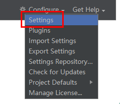
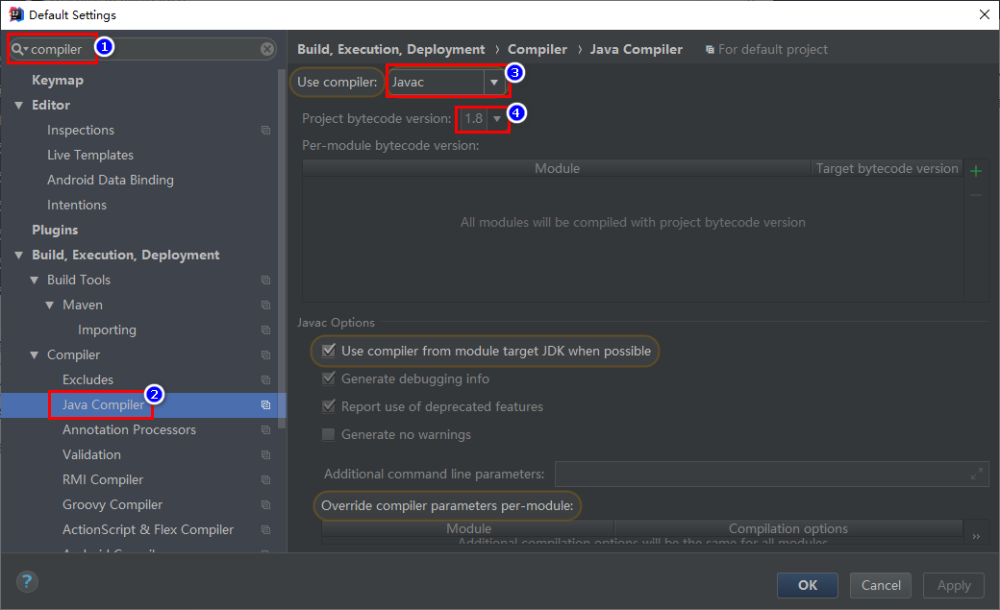
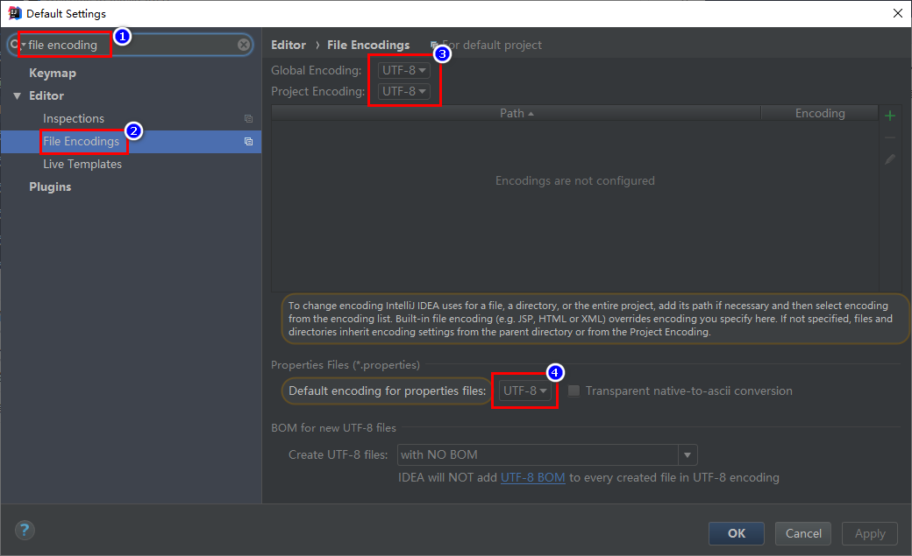
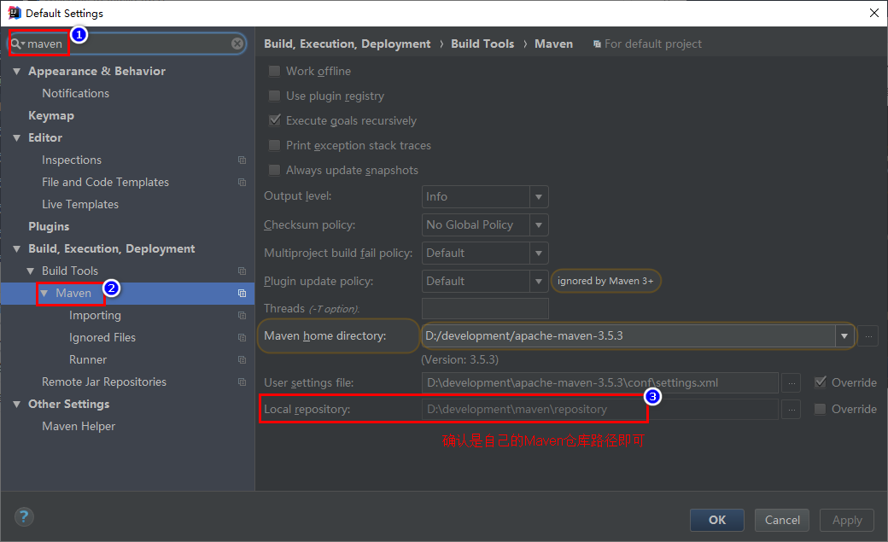
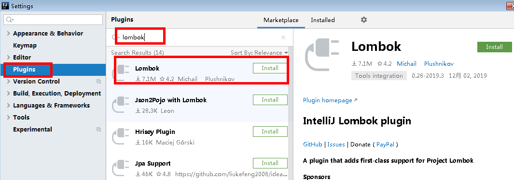
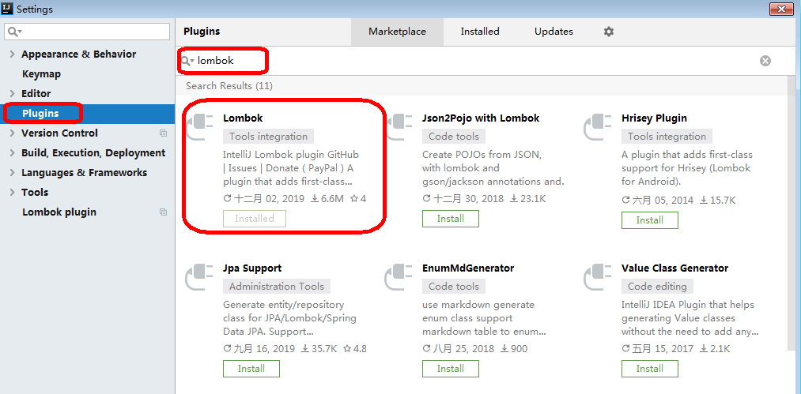
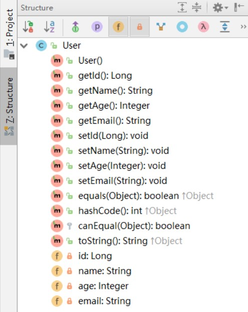
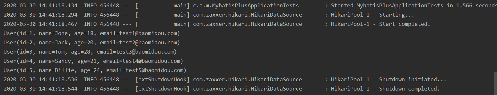
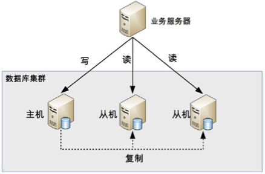
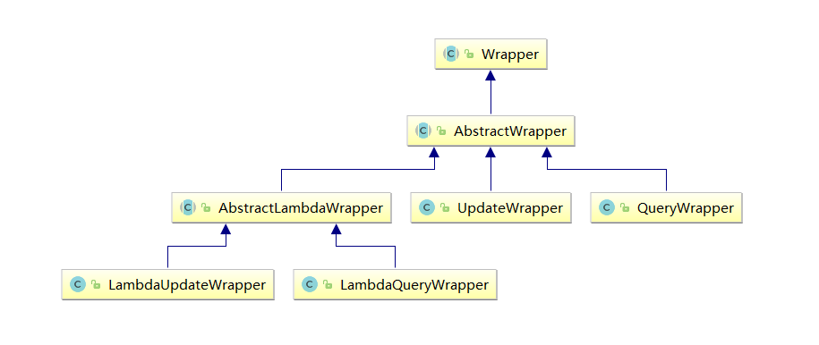

# 1. Mybatis-Plus-环境准备

官网：[http://mp.baomidou.com](http://mp.baomidou.com/guide/)

参考教程：http://mp.baomidou.com/guide/

## 一、简介

[MyBatis-Plus](https://github.com/baomidou/mybatis-plus)（简称 MP）是一个 [MyBatis](http://www.mybatis.org/mybatis-3/) 的增强工具，在 MyBatis 的基础上只做增强不做改变，为简化开发、提高效率而生。

- 润物无声  

- - 只做增强不做改变，引入它不会对现有工程产生影响，如丝般顺滑。

- 效率至上

- - 只需简单配置，即可快速进行 CRUD 操作，从而节省大量时间。

- 丰富功能

- - 热加载、代码生成、分页、性能分析等功能一应俱全。

## 二、创建并初始化数据库

## 1、创建数据库

mybatis_plus

## 2、创建 `User` 表

其对应的数据库 Schema 脚本如下：

 

```
CREATE TABLE user
(
    id BIGINT(20) NOT NULL COMMENT '主键ID',
    name VARCHAR(30) NULL DEFAULT NULL COMMENT '姓名',
    age INT(11) NULL DEFAULT NULL COMMENT '年龄',
    email VARCHAR(50) NULL DEFAULT NULL COMMENT '邮箱',
    PRIMARY KEY (id)
);
```

其对应的数据库 Data 脚本如下：

 

```
INSERT INTO user (id, name, age, email) VALUES
(1, 'Jone', 18, 'test1@baomidou.com'),
(2, 'Jack', 20, 'test2@baomidou.com'),
(3, 'Tom', 28, 'test3@baomidou.com'),
(4, 'Sandy', 21, 'test4@baomidou.com'),
(5, 'Billie', 24, 'test5@baomidou.com');
```

## **三、确认idea配置**

## 1、打开配置




## 2、Java编译器



## 3、项目和文件的编码



## 4、Maven配置




## **四、创建项目**

## **1、初始化工程**

使用 Spring Initializr 快速初始化一个 Spring Boot 工程

Group：com.atguigu

Artifact：mybatis_plus

版本：2.2.1.RELEASE

## 2、引入依赖

**注意：**引入 `MyBatis-Plus` 之后请不要再次引入 `MyBatis`，以避免因版本差异导致的问题。

 

```
<dependencies>
    <dependency>
        <groupId>org.springframework.boot</groupId>
        <artifactId>spring-boot-starter</artifactId>
    </dependency>
    <dependency>
        <groupId>org.springframework.boot</groupId>
        <artifactId>spring-boot-starter-test</artifactId>
        <scope>test</scope>
        <exclusions>
            <exclusion>
                <groupId>org.junit.vintage</groupId>
                <artifactId>junit-vintage-engine</artifactId>
            </exclusion>
        </exclusions>
    </dependency>
    <!--mybatis-plus-->
    <dependency>
        <groupId>com.baomidou</groupId>
        <artifactId>mybatis-plus-boot-starter</artifactId>
        <version>3.3.1</version>
    </dependency>
    <!--mysql运行时依赖-->
    <dependency>
        <groupId>mysql</groupId>
        <artifactId>mysql-connector-java</artifactId>
        <scope>runtime</scope>
    </dependency>
    <!--lombok用来简化实体类-->
    <dependency>
        <groupId>org.projectlombok</groupId>
        <artifactId>lombok</artifactId>
        <optional>true</optional>
    </dependency>
</dependencies>
```

## 

## **3、idea中安装lombok插件**

***\*（1）idea2019版本\**
（2）idea2018版本**



## **五、编写代码 **

## **1、配置**

在 `application.properties` 配置文件中添加 MySQL 数据库的相关配置：

spring boot 2.0（内置jdbc5驱动）

 

```
##mysql数据库连接
spring.datasource.driver-class-name=com.mysql.jdbc.Driver
spring.datasource.url=jdbc:mysql://localhost:3306/mybatis_plus?characterEncoding=utf-8&useSSL=false
spring.datasource.username=root
spring.datasource.password=root
```

spring boot 2.1及以上（内置jdbc8驱动）

**注意：**driver和url的变化

 

```
spring.datasource.driver-class-name=com.mysql.cj.jdbc.Driver
spring.datasource.url=jdbc:mysql://localhost:3306/mybatis_plus?serverTimezone=GMT%2B8
spring.datasource.username=root
spring.datasource.password=123456
```

**注意：**

1、这里的 url 使用了 ?serverTimezone=GMT%2B8 后缀，因为8.0版本的jdbc驱动需要添加这个后缀，否则运行测试用例报告如下错误：

java.sql.SQLException: The server time zone value 'Öйú±ê׼ʱ¼ä' is unrecognized or represents more 

2、这里的 driver-class-name 使用了  com.mysql.cj.jdbc.Driver ，在 jdbc 8 中 建议使用这个驱动，否则运行测试用例的时候会有 WARN 信息

2、主类

在 Spring Boot 启动类中添加 `@MapperScan` 注解，扫描 Mapper 文件夹

 

```
@SpringBootApplication
@MapperScan("com.atguigu.mybatis_plus.mapper")
public class MybatisPlusApplication {
    ......
}
```

## 3、实体

创建包 entity 编写实体类 `User.java（此处使用了 Lombok 简化代码）`

 

```
@Data
public class User {
    private Long id;
    private String name;
    private Integer age;
    private String email;
}
```

查看编译结果



## 4、mapper

创建包 mapper 编写Mapper 接口： `UserMapper.java`

 

```
public interface UserMapper extends BaseMapper<User> {
    
}
```

## 5、测试

添加测试类，进行功能测试：

 

```
package com.atguigu.mybatis_plus;
@SpringBootTest
class MybatisPlusApplicationTests {
    @Autowired
    private UserMapper userMapper;
    @Test
    void testSelectList() {
        //UserMapper 中的 selectList() 方法的参数为 MP 内置的条件封装器 Wrapper
        //所以不填写就是无任何条件
        List<User> users = userMapper.selectList(null);
        users.forEach(System.out::println);
    }
}
```

**注意：**

IDEA在 userMapper 处报错，因为找不到注入的对象，因为类是动态创建的，但是程序可以正确的执行。

为了避免报错，可以在 dao 层 的接口上添加 @Repository 注解

```
@Component is a generic stereotype for any Spring-managed component
@Service annotates classes at the service layer
@Repository annotates classes at the persistence layer, which will act as a database repository
```


通过以上几个简单的步骤，我们就实现了 User 表的 CRUD 功能，甚至连 XML 文件都不用编写！


查看控制台输出：




## 6、查看sql输出日志

 

```
##mybatis日志
mybatis-plus.configuration.log-impl=org.apache.ibatis.logging.stdout.StdOutImpl
```


# 2. 插入操作与主键策略


## **一、插入操作**

```
@SpringBootTest
public class CRUDTests {  
    @Autowired
    private UserMapper userMapper;
    @Test
    public void testInsert(){
        User user = new User();
        user.setName("Helen");
        user.setAge(18);
        user.setEmail("55317332@qq.com");
        int result = userMapper.insert(user);
        System.out.println("影响的行数：" + result); //影响的行数
        System.out.println("id：" + user); //id自动回填
    }
}
```

**注意：**数据库插入id值默认为：全局唯一id


## 二、数据库分库分表策略

## **背景**

随着业务规模的不断扩大，需要选择合适的方案去应对数据规模的增长，以应对逐渐增长的访问压力和数据量。

数据库的扩展方式主要包括：业务分库、主从复制，数据库分表。

## 1、业务分库

业务分库指的是按照业务模块将数据分散到不同的数据库服务器。例如，一个简单的电商网站，包括用户、商品、订单三个业务模块，我们可以将用户数据、商品数据、订单数据分开放到三台不同的数据库服务器上，而不是将所有数据都放在一台数据库服务器上。这样的就变成了3个数据库同时承担压力，系统的吞吐量自然就提高了。


虽然业务分库能够分散存储和访问压力，但同时也带来了新的问题，接下来我进行详细分析。

- join 操作问题

- - 业务分库后，原本在同一个数据库中的表分散到不同数据库中，导致无法使用 SQL 的 join 查询。

- 事务问题

- - 原本在同一个数据库中不同的表可以在同一个事务中修改，业务分库后，表分散到不同的数据库中，无法通过事务统一修改。

- 成本问题

- - 业务分库同时也带来了成本的代价，本来 1 台服务器搞定的事情，现在要 3 台，如果考虑备份，那就是 2 台变成了 6 台。

## 2、主从复制和读写分离

读写分离的基本原理是将数据库读写操作分散到不同的节点上。读写分离的基本实现是：

- 数据库服务器搭建主从集群，一主一从、一主多从都可以。
- 数据库主机负责读写操作，从机只负责读操作。
- 数据库主机通过复制将数据同步到从机，每台数据库服务器都存储了所有的业务数据。
- 业务服务器将写操作发给数据库主机，将读操作发给数据库从机。



需要注意的是，这里用的是“主从集群”，而不是“主备集群”。“从机”的“从”可以理解为“仆从”，仆从是要帮主人干活的，“从机”是需要提供读数据的功能的；而“备机”一般被认为仅仅提供备份功能，不提供访问功能。所以使用“主从”还是“主备”，是要看场景的，这两个词并不是完全等同。

## 3、数据库分表

将不同业务数据分散存储到不同的数据库服务器，能够支撑百万甚至千万用户规模的业务，但如果业务继续发展，同一业务的单表数据也会达到单台数据库服务器的处理瓶颈。例如，淘宝的几亿用户数据，如果全部存放在一台数据库服务器的一张表中，肯定是无法满足性能要求的，此时就需要对单表数据进行拆分。

单表数据拆分有两种方式：垂直分表和水平分表。示意图如下：


单表进行切分后，是否要将切分后的多个表分散在不同的数据库服务器中，可以根据实际的切分效果来确定。如果性能能够满足业务要求，是可以不拆分到多台数据库服务器的，毕竟我们在上面业务分库的内容看到业务分库也会引入很多复杂性的问题。分表能够有效地分散存储压力和带来性能提升，但和分库一样，也会引入各种复杂性：

- 垂直分表：

- - 垂直分表适合将表中某些不常用且占了大量空间的列拆分出去。
  - 例如，前面示意图中的 nickname 和 description 字段，假设我们是一个婚恋网站，用户在筛选其他用户的时候，主要是用 age 和 sex 两个字段进行查询，而 nickname 和 description 两个字段主要用于展示，一般不会在业务查询中用到。description 本身又比较长，因此我们可以将这两个字段独立到另外一张表中，这样在查询 age 和 sex 时，就能带来一定的性能提升。

- 水平分表：

- - 水平分表适合表行数特别大的表，有的公司要求单表行数超过 5000 万就必须进行分表，这个数字可以作为参考，但并不是绝对标准，关键还是要看表的访问性能。对于一些比较复杂的表，可能超过 1000 万就要分表了；而对于一些简单的表，即使存储数据超过 1 亿行，也可以不分表。
  - 但不管怎样，当看到表的数据量达到千万级别时，作为架构师就要警觉起来，因为这很可能是架构的性能瓶颈或者隐患。

水平分表相比垂直分表，会引入更多的复杂性，例如数据id：

- 主键自增：

- - 以最常见的用户 ID 为例，可以按照 1000000 的范围大小进行分段，1 ~ 999999 放到表 1中，1000000 ~ 1999999 放到表2中，以此类推。
  - 复杂点：分段大小的选取。分段太小会导致切分后子表数量过多，增加维护复杂度；分段太大可能会导致单表依然存在性能问题，一般建议分段大小在 100 万至 2000 万之间，具体需要根据业务选取合适的分段大小。
  - 优点：可以随着数据的增加平滑地扩充新的表。例如，现在的用户是 100 万，如果增加到 1000 万，只需要增加新的表就可以了，原有的数据不需要动。
  - 缺点：分布不均匀，假如按照 1000 万来进行分表，有可能某个分段实际存储的数据量只有 1000 条，而另外一个分段实际存储的数据量有 900 万条。

- Hash ：

- - 同样以用户 ID 为例，假如我们一开始就规划了 10 个数据库表，路由算法可以简单地用 user_id % 10 的值来表示数据所属的数据库表编号，ID 为 985 的用户放到编号为 5 的子表中，ID 为 10086 的用户放到编号为 6 的字表中。
  - 复杂点：初始表数量的选取。表数量太多维护比较麻烦，表数量太少又可能导致单表性能存在问题。
  - 优点：表分布比较均匀。
  - 缺点：扩充新的表很麻烦，所有数据都要重分布。

- **雪花算法：分布式ID生成器**

- - 雪花算法是由Twitter公布的分布式主键生成算法，它能够保证不同表的主键的不重复性，以及相同表的主键的有序性。

  - 核心思想：

  - - 长度共64bit（一个long型）。
    - 首先是一个符号位，1bit标识，由于long基本类型在Java中是带符号的，最高位是符号位，正数是0，负数是1，所以id一般是正数，最高位是0。
    - 41bit时间截(毫秒级)，存储的是时间截的差值（当前时间截 - 开始时间截)，结果约等于69.73年。
    - 10bit作为机器的ID（5个bit是数据中心，5个bit的机器ID，可以部署在1024个节点）。
    - 12bit作为毫秒内的流水号（意味着每个节点在每毫秒可以产生 4096 个 ID）。


- - **优点：**整体上按照时间自增排序，并且整个分布式系统内不会产生ID碰撞，并且效率较高。

## 三、MP的主键策略

## **1、ASSIGN_ID**

MyBatis-Plus默认的主键策略是：ASSIGN_ID （使用了雪花算法）

 

```
@TableId(type = IdType.ASSIGN_ID)
private String id;
```

## **2、AUTO 自增策略**

- 需要在创建数据表的时候设置主键自增
- 实体字段中配置 @TableId(type = IdType.AUTO)

 

```
@TableId(type = IdType.AUTO)
private Long id;
```

要想影响所有实体的配置，可以设置全局主键配置

 

```
##全局设置主键生成策略
mybatis-plus.global-config.db-config.id-type=auto
```


# 3. 更新操作 与 填充策略

## **一、更新操作**

**注意：**update时生成的sql自动是动态sql：UPDATE user SET age=? WHERE id=? 

 

```
@Test
public void testUpdateById(){  
    User user = new User();
    user.setId(1L);
    user.setAge(28);
    int result = userMapper.updateById(user);
    System.out.println("影响的行数：" + result);
}
```

## 二、自动填充

## 需求描述：

项目中经常会遇到一些数据，每次都使用相同的方式填充，例如记录的创建时间，更新时间等。

我们可以使用MyBatis Plus的自动填充功能，完成这些字段的赋值工作

## **1、数据库修改**

在User表中添加datetime类型的新的字段 create_time、update_time

```sql
ALTER TABLE `user` ADD COLUMN create_time datetime; 
ALTER TABLE `user` ADD COLUMN update_time datetime;
```

## 2、实体类修改

实体上增加字段并添加自动填充注解

 

```
@Data
public class User {
    ......
        
    @TableField(fill = FieldFill.INSERT)
    private Date createTime;
    //@TableField(fill = FieldFill.UPDATE)
    @TableField(fill = FieldFill.INSERT_UPDATE)
    private Date updateTime;
}
```

## **3、实现元对象处理器接口**

注意：不要忘记添加 @Component 注解

 

```
package com.atguigu.mybatisplus.handler;
@Slf4j
@Component
public class MyMetaObjectHandler implements MetaObjectHandler {
    @Override
    public void insertFill(MetaObject metaObject) {
        log.info("start insert fill ....");
        this.setFieldValByName("createTime", new Date(), metaObject);
        this.setFieldValByName("updateTime", new Date(), metaObject);
    }
    @Override
    public void updateFill(MetaObject metaObject) {
        log.info("start update fill ....");
        this.setFieldValByName("updateTime", new Date(), metaObject);
    }
}
```

## 4、测试

## 三、乐观锁

## **1、场景**

一件商品，成本价是80元，售价是100元。老板先是通知小李，说你去把商品价格增加50元。小李正在玩游戏，耽搁了一个小时。正好一个小时后，老板觉得商品价格增加到150元，价格太高，可能会影响销量。又通知小王，你把商品价格降低30元。

此时，小李和小王同时操作商品后台系统。小李操作的时候，系统先取出商品价格100元；小王也在操作，取出的商品价格也是100元。小李将价格加了50元，并将100+50=150元存入了数据库；小王将商品减了30元，并将100-30=70元存入了数据库。是的，如果没有锁，小李的操作就完全被小王的覆盖了。

现在商品价格是70元，比成本价低10元。几分钟后，这个商品很快出售了1千多件商品，老板亏1多万。

## 2、乐观锁与悲观锁

- 上面的故事，如果是乐观锁，小王保存价格前，会检查下价格是否被人修改过了。如果被修改过了，则重新取出的被修改后的价格，150元，这样他会将120元存入数据库。
- 如果是悲观锁，小李取出数据后，小王只能等小李操作完之后，才能对价格进行操作，也会保证最终的价格是120元。

接下来将我们演示这一过程：

## 3、模拟修改冲突

### （1）数据库中增加商品表

 

```
CREATE TABLE product
(
    id BIGINT(20) NOT NULL COMMENT '主键ID',
    name VARCHAR(30) NULL DEFAULT NULL COMMENT '商品名称',
    price INT(11) DEFAULT 0 COMMENT '价格',
    version INT(11) DEFAULT 0 COMMENT '乐观锁版本号',
    PRIMARY KEY (id)
);
```

### （2）添加数据

 

```
INSERT INTO product (id, NAME, price) VALUES (1, '外星人笔记本', 100);
```

### （3）实体类

 

```
package com.atguigu.mybatis_plus.entity;
@Data
public class Product {
    private Long id;
    private String name;
    private Integer price;
    private Integer version;
}
```

### （4）Mapper

 

```
package com.atguigu.mybatis_plus.mapper;
@Repository
public interface ProductMapper extends BaseMapper<Product> {
    
}
```

### （5）测试

 

```
@Autowired
private ProductMapper productMapper;
@Test
public void testConcurrentUpdate() {
    //1、小李
    Product p1 = productMapper.selectById(1L);
    System.out.println("小李取出的价格：" + p1.getPrice());
    //2、小王
    Product p2 = productMapper.selectById(1L);
    System.out.println("小王取出的价格：" + p2.getPrice());
    //3、小李将价格加了50元，存入了数据库
    p1.setPrice(p1.getPrice() + 50);
    productMapper.updateById(p1);
    //4、小王将商品减了30元，存入了数据库
    p2.setPrice(p2.getPrice() - 30);
    int result = productMapper.updateById(p2);
    if(result == 0){//更新失败，重试
        //重新获取数据
        p2 = productMapper.selectById(1L);
        //更新
        p2.setPrice(p2.getPrice() - 30);
        productMapper.updateById(p2);
    }
    //最后的结果
    Product p3 = productMapper.selectById(1L);
    System.out.println("最后的结果：" + p3.getPrice());
}
```

## **4、解决方案** 

数据库中添加version字段
取出记录时，获取当前version

 

```
SELECT id,`name`,price,`version` FROM product WHERE id=1
```

更新时，version + 1，如果where语句中的version版本不对，则更新失败

 

```
UPDATE product SET price=price+50, `version`=`version` + 1 WHERE id=1 AND `version`=1
```

接下来介绍如何在Mybatis-Plus项目中，使用乐观锁：

## 5、乐观锁实现流程

### **（1）修改实体类**

添加 @Version 注解

```
@Version
private Integer version;
```

### **（2）创建配置文件** 

创建包config，创建文件MybatisPlusConfig.java

此时可以删除主类中的 *@MapperScan* 扫描注解

 

```
package com.atguigu.mybatis_plus.config;
@EnableTransactionManagement
@Configuration
@MapperScan("com.atguigu.mybatis_plus.mapper")
public class MybatisPlusConfig {

}
```

### **（3）\**注册乐观锁插件\****

在 MybatisPlusConfig 中注册 Bean

 

```
/**
     * 乐观锁插件
     */
@Bean
public OptimisticLockerInterceptor optimisticLockerInterceptor() {
    return new OptimisticLockerInterceptor();
}
```

### **（4）测试**


# 4. 批量查询， 条件查询， 分页查询 

## 一、查询

## 1、通过多个id批量查询

完成了动态sql的foreach的功能  

 

```
@Test
public void testSelectBatchIds(){
    List<User> users = userMapper.selectBatchIds(Arrays.asList(1, 2, 3));
    users.forEach(System.out::println);
}
```

## **2、简单的条件查询**

通过map封装查询条件

**注意：**map中的key对应数据库中的列名。如：数据库user_id，实体类是userId，这时map的key需要填写user_id

 

```
@Test
public void testSelectByMap(){
    HashMap<String, Object> map = new HashMap<>();
    map.put("name", "Helen");
    map.put("age", 18);
    List<User> users = userMapper.selectByMap(map);
    users.forEach(System.out::println);
}
```

## 二、分页

## 1、分页插件

MyBatis Plus自带分页插件，只要简单的配置即可实现分页功能

（1）添加分页插件

配置类中添加@Bean配置

 

```
/**
 * 分页插件
 */
@Bean
public PaginationInterceptor paginationInterceptor() {
    return new PaginationInterceptor();
}
```

**（2）测试selectPage分页**

**测试：**最终通过page对象获取相关数据

 

```
@Test
public void testSelectPage() {
    Page<User> page = new Page<>(1,5);
    Page<User> pageParam = userMapper.selectPage(page, null);
    pageParam.getRecords().forEach(System.out::println);
    System.out.println(pageParam.getCurrent());
    System.out.println(pageParam.getPages());
    System.out.println(pageParam.getSize());
    System.out.println(pageParam.getTotal());
    System.out.println(pageParam.hasNext());
    System.out.println(pageParam.hasPrevious());
}
```

控制台sql语句打印：SELECT id,name,age,email,create_time,update_time FROM user LIMIT 0,5 

## 2、返回指定的列

当指定了特定的查询列时，希望分页结果列表只返回被查询的列，而不是很多null值

**测试selectMapsPage分页：结果集是Map**

 

```
@Test
public void testSelectMapsPage() {
    //返回很多null列
    //Page<User> page = new Page<>(1, 5);
    //QueryWrapper<User> queryWrapper = new QueryWrapper<>();
    //queryWrapper.select("name", "age");
    //Page<User> pageParam = userMapper.selectPage(page, queryWrapper);
    //
    //pageParam.getRecords().forEach(System.out::println);
    //Page不需要泛型
    Page<Map<String, Object>> page = new Page<>(1, 5);
    QueryWrapper<User> queryWrapper = new QueryWrapper<>();
    queryWrapper.select("name", "age");
    Page<Map<String, Object>> pageParam = userMapper.selectMapsPage(page, queryWrapper);
    List<Map<String, Object>> records = pageParam.getRecords();
    records.forEach(System.out::println);
    System.out.println(pageParam.getCurrent());
    System.out.println(pageParam.getPages());
    System.out.println(pageParam.getSize());
    System.out.println(pageParam.getTotal());
    System.out.println(pageParam.hasNext());
    System.out.println(pageParam.hasPrevious());
}
```


# 5. 批量删除与逻辑删除

## **一、删除**

## **1、根据id删除记录**  

 

```
@Test
public void testDeleteById(){
    int result = userMapper.deleteById(5L);
    System.out.println(result);
}
```

## **2、批量删除**

 

```
@Test
public void testDeleteBatchIds() {
    int result = userMapper.deleteBatchIds(Arrays.asList(8, 9, 10));
    System.out.println(result);
}
```

## **3、简单条件删除**

 

```
@Test
public void testDeleteByMap() {
    HashMap<String, Object> map = new HashMap<>();
    map.put("name", "Helen");
    map.put("age", 18);
    int result = userMapper.deleteByMap(map);
    System.out.println(result);
}
```

## 二、逻辑删除

## 1、物理删除和逻辑删除

- 物理删除：真实删除，将对应数据从数据库中删除，之后查询不到此条被删除数据
- 逻辑删除：假删除，将对应数据中代表是否被删除字段状态修改为“被删除状态”，之后在数据库中仍旧能看到此条数据记录

**逻辑删除的使用场景：**

- 可以进行数据恢复
- 有关联数据，不便删除

## 2、逻辑删除实现流程

### **（1）数据库修改**

添加 deleted字段

 

```
ALTER TABLE `user` ADD COLUMN `deleted` boolean DEFAULT false
```

### **（2）实体类修改**

添加deleted 字段，并加上 @TableLogic 注解 

 

```
@TableLogic
private Integer deleted;
```

### **（3）配置（可选）**

application.properties 加入以下配置，此为默认值，如果你的默认值和mp默认的一样,该配置可无

 

```
mybatis-plus.global-config.db-config.logic-delete-value=1
mybatis-plus.global-config.db-config.logic-not-delete-value=0
```

### **（4）测试**


- 测试后发现，数据并没有被删除，deleted字段的值由0变成了1
- 测试后分析打印的sql语句，是一条update
- **注意：**被删除前，数据的deleted 字段的值必须是 0，才能被选取出来执行逻辑删除的操作

 

```
@Test
public void testLogicDelete() {
    int result = userMapper.deleteById(1L);
    System.out.println(result);
}
```

### **（5）测试逻辑删除后的查询**

MyBatis Plus中查询操作也会自动添加逻辑删除字段的判断

 

```
@Test
public void testLogicDeleteSelect() {
    
    List<User> users = userMapper.selectList(null);
    users.forEach(System.out::println);
}
```


# 6. 查询条件

## **一、wapper介绍** 



Wrapper ： 条件构造抽象类，最顶端父类  

  AbstractWrapper ： 用于查询条件封装，生成 sql 的 where 条件

​    QueryWrapper ： 查询条件封装

​    UpdateWrapper ： Update 条件封装

  AbstractLambdaWrapper ： 使用Lambda 语法

​    LambdaQueryWrapper ：用于Lambda语法使用的查询Wrapper

​    LambdaUpdateWrapper ： Lambda 更新封装Wrapper

 

```
@SpringBootTest
public class QueryWrapperTests {
    
    @Autowired
    private UserMapper userMapper;
}
```

## 二、测试用例

## **1、ge、gt、le、lt、isNull、isNotNull**

 

```
@Test
public void testDelete() {
    QueryWrapper<User> queryWrapper = new QueryWrapper<>();
    queryWrapper
        .isNull("name")
        .ge("age", 12)
        .isNotNull("email");
    int result = userMapper.delete(queryWrapper);
    System.out.println("delete return count = " + result);
}
```

## **2、eq、ne**

**注意：**seletOne()返回的是一条实体记录，当出现多条时会报错

 

```
@Test
public void testSelectOne() {
    QueryWrapper<User> queryWrapper = new QueryWrapper<>();
    queryWrapper.eq("name", "Tom");
    User user = userMapper.selectOne(queryWrapper);//只能返回一条记录，多余一条则抛出异常
    System.out.println(user);
}
```

## **3、between、notBetween**

包含大小边界

 

```
@Test
public void testSelectCount() {
    QueryWrapper<User> queryWrapper = new QueryWrapper<>();
    queryWrapper.between("age", 20, 30);
    Integer count = userMapper.selectCount(queryWrapper); //返回数据数量
    System.out.println(count);
}
```

## **4、like、notLike、likeLeft、likeRight**

selectMaps()返回Map集合列表，通常配合select()使用

 

```
@Test
public void testSelectMaps() {
    QueryWrapper<User> queryWrapper = new QueryWrapper<>();
    queryWrapper
        .select("name", "age")
        .like("name", "e")
        .likeRight("email", "5");
    List<Map<String, Object>> maps = userMapper.selectMaps(queryWrapper);//返回值是Map列表
    maps.forEach(System.out::println);
}
```

## **5、in、notIn、inSql、notinSql、exists、notExists**

in、notIn：

```
notIn("age",{1,2,3})--->age not in (1,2,3)notIn("age", 1, 2, 3)--->age not in (1,2,3)
```

inSql、notinSql：可以实现子查询

- 例: `inSql("age", "1,2,3,4,5,6")`--->`age in (1,2,3,4,5,6)`
- 例: `inSql("id", "select id from table where id < 3")`--->`id in (select id from table where id < 3)`

 

```
    @Test
    public void testSelectObjs() {
        QueryWrapper<User> queryWrapper = new QueryWrapper<>();
//        queryWrapper.in("id", 1, 2, 3);
        queryWrapper.inSql("id", "select id from user where id <= 3");
        List<Object> objects = userMapper.selectObjs(queryWrapper);//返回值是Object列表
        objects.forEach(System.out::println);
    }
```

## **6、or、and**

**注意：**这里使用的是 UpdateWrapper 

不调用`or`则默认为使用 `and `连

 

```
@Test
public void testUpdate1() {
    //修改值
    User user = new User();
    user.setAge(99);
    user.setName("Andy");
    //修改条件
    UpdateWrapper<User> userUpdateWrapper = new UpdateWrapper<>();
    userUpdateWrapper
        .like("name", "h")
        .or()
        .between("age", 20, 30);
    int result = userMapper.update(user, userUpdateWrapper);
    System.out.println(result);
}
```

## **7、lambda表达式**

lambda表达式内的逻辑优先运算 

```
@Test
public void testUpdate2() {
    //修改值
    User user = new User();
    user.setAge(99);
    user.setName("Andy");
    //修改条件
    UpdateWrapper<User> userUpdateWrapper = new UpdateWrapper<>();
    userUpdateWrapper
        .like("name", "n")
        .or(i -> i.like("name", "a").eq("age", 20));
    int result = userMapper.update(user, userUpdateWrapper);
    System.out.println(result);
}
```

## **8、orderBy、orderByDesc、orderByAsc**

 

```
@Test
public void testSelectListOrderBy() {
    QueryWrapper<User> queryWrapper = new QueryWrapper<>();
    queryWrapper.orderByDesc("age", "id");
    List<User> users = userMapper.selectList(queryWrapper);
    users.forEach(System.out::println);
}
```

## **9、set、setSql** 

最终的sql会合并 user.setAge()，以及 userUpdateWrapper.set()  和 setSql() 中 的字段

 

```
@Test
public void testUpdateSet() {
    //修改值
    User user = new User();
    user.setAge(60);
    //修改条件
    UpdateWrapper<User> userUpdateWrapper = new UpdateWrapper<>();
    userUpdateWrapper
        .like("name", "h")
        .set("name", "Peter")//除了可以查询还可以使用set设置修改的字段
        .setSql(" email = '123@qq.com'");//可以有子查询
    int result = userMapper.update(user, userUpdateWrapper);
}
```

## 三、查询方式

| **查询方式**     | **说明**                          |
| ---------------- | --------------------------------- |
| **setSqlSelect** | 设置 SELECT 查询字段              |
| **where**        | WHERE 语句，拼接 + WHERE 条件     |
| **and**          | AND 语句，拼接 + AND 字段=值      |
| **andNew**       | AND 语句，拼接 + AND (字段=值)    |
| **or**           | OR 语句，拼接 + OR 字段=值        |
| **orNew**        | OR 语句，拼接 + OR (字段=值)      |
| **eq**           | 等于=                             |
| **allEq**        | 基于 map 内容等于=                |
| **ne**           | 不等于<>                          |
| **gt**           | 大于>                             |
| **ge**           | 大于等于>=                        |
| **lt**           | 小于<                             |
| **le**           | 小于等于<=                        |
| **like**         | 模糊查询 LIKE                     |
| **notLike**      | 模糊查询 NOT LIKE                 |
| **in**           | IN 查询                           |
| **notIn**        | NOT IN 查询                       |
| **isNull**       | NULL 值查询                       |
| **isNotNull**    | IS NOT NULL                       |
| **groupBy**      | 分组 GROUP BY                     |
| **having**       | HAVING 关键词                     |
| **orderBy**      | 排序 ORDER BY                     |
| **orderAsc**     | ASC 排序 ORDER BY                 |
| **orderDesc**    | DESC 排序 ORDER BY                |
| **exists**       | EXISTS 条件语句                   |
| **notExists**    | NOT EXISTS 条件语句               |
| **between**      | BETWEEN 条件语句                  |
| **notBetween**   | NOT BETWEEN 条件语句              |
| **addFilter**    | 自由拼接 SQL                      |
| **last**         | 拼接在最后，例如：last(“LIMIT 1”) |

